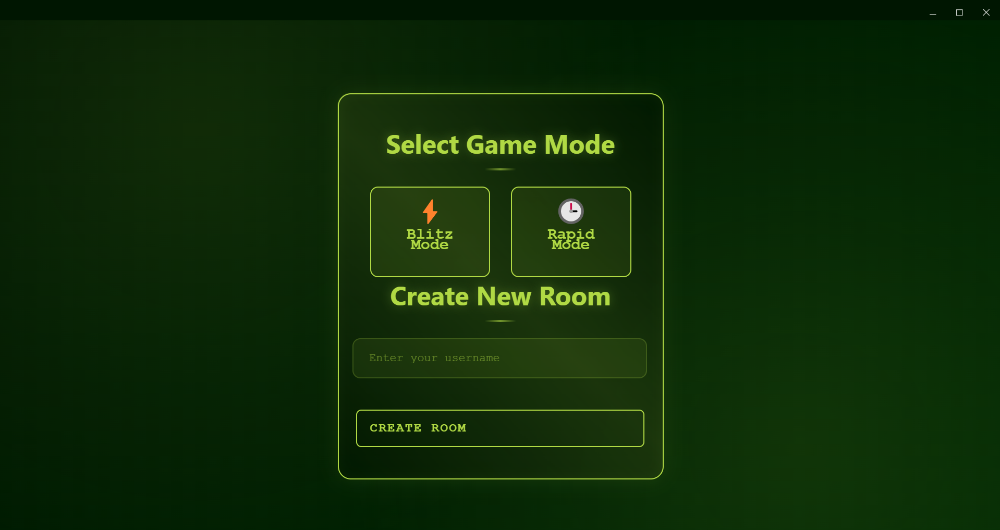
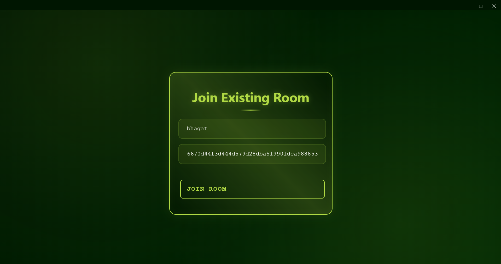
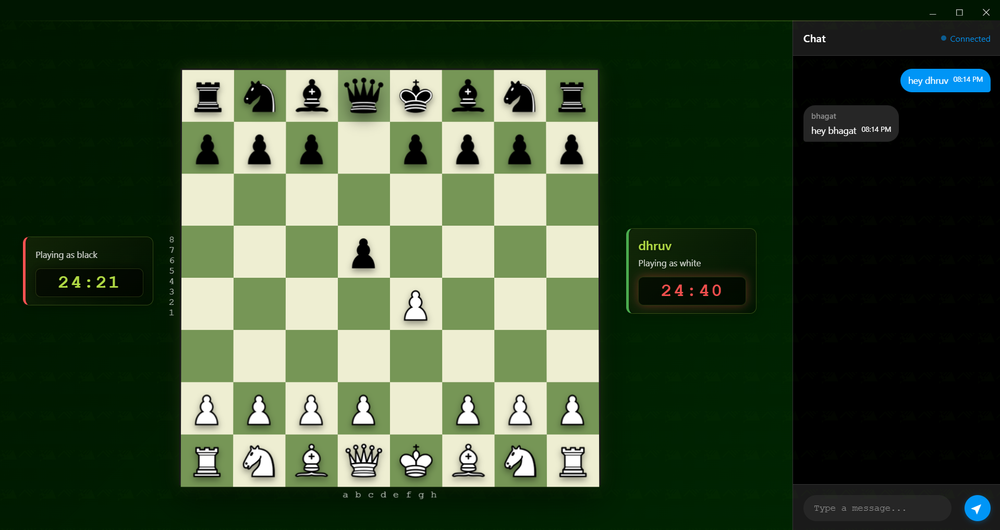

# 🎮 P2P Chess Game

A real-time peer-to-peer chess game built with modern web technologies. Play chess with friends directly through your pc/laptop with no server required!








## ✨ Features

- **Real-time P2P Gameplay**: Play chess with anyone, anywhere using decentralized P2P networking
- **Play with Your Friend** : create room or join existing room using room token
- **Play with Stranger** : play chess with random person on public room
- **Valid Move Highlighting**: Visual feedback for possible moves
- **In-game Timer**: Multiple game modes based on time
- **In-game Chat**: Communicate with your opponent during the match
- **Sound Effects**: Immersive audio feedback for moves, checks, and game events
- **Game State Synchronization**: Real-time state updates between players

## 🛠 Tech Stack

### Core Technologies
- **Frontend**: HTML5, CSS3, JavaScript (ES6+)
- **Game Engine**: [js-chess-engine](https://github.com/josefjadrny/js-chess-engine)
- **P2P Networking**: [Hyperswarm](https://github.com/hyperswarm/hyperswarm)
- **Pear by Holepunch** : [Pear](https://docs.pears.com/)

### Additional Libraries
- hypercore-crypto
- b4a

### Architecture
- Peer-to-peer connection using Hyperswarm
- Real-time game state synchronization
- Client-side move validation
- Event-driven architecture

## 🚀 Installation & Setup

### Prerequisites
- Node.js (v14 or higher)
- npm (Node Package Manager)
- Pear latest version

### Steps to Install & Run

1. Clone the repository:
   ```sh
   git clone https://github.com/Dhruv54/P2P-Chess-Game.git
   ```

2. Navigate to the chess directory:
   ```sh
   cd P2P-Chess-Game/chess
   ```

3. Install dependencies:
   ```sh
   npm install
   ```

4. Start the game:
   ```sh
   pear run --dev .
   ```
   or
   ```sh
   pear run dev .
   ```

## 🎮 How to Play

1. **Starting a Game**:
   - Launch the application
   - Create a new room or join an existing one
   - Share your game ID with a friend
   - Wait for an opponent to join

2. **Joining a Game**:
   - Click "Join Game"
   - Enter the game ID shared by your friend
   - Wait for connection

2. **Play With Stranger**:
   - Click "Play With Stranger"
   - Wait for opponent to join

3. **Playing**:
   - The creator plays as White
   - The joiner plays as Black
   - Click on a piece to select it
   - Click on a valid square to move the selected piece
   - Use the chat box to communicate with your opponent
   - Valid moves are highlighted in green

## 🌐 P2P Connection

The game uses Hyperswarm for peer-to-peer connectivity:
- No central server required
- Direct player-to-player connection
- Secure and private gameplay
- Low latency moves

## 📝 Development Notes

### Debug Mode
The debug panel provides real-time information about:
- Move validation
- Game state changes
- P2P connection status
- Error messages

## 🎯 Features in Development

- [ ] Move history and notation
- [ ] Spectator mode
- [ ] Game analysis tools
- [ ] Rating based match-making

## 🤝 Contributing

Contributions are welcome! Please feel free to submit a Pull Request.

1. Fork the repository
2. Create your feature branch (`git checkout -b feature/AmazingFeature`)
3. Commit your changes (`git commit -m 'Add some AmazingFeature'`)
4. Push to the branch (`git push origin feature/AmazingFeature`)
5. Open a Pull Request

## 🙌 Acknowledgments

- [js-chess-engine](https://github.com/josefjadrny/js-chess-engine) for the chess game logic
- [Hyperswarm](https://github.com/hyperswarm/hyperswarm) for P2P networking capabilities
- Chess piece images from [Chess.com](https://www.chess.com)
- Community feedback and contributions
